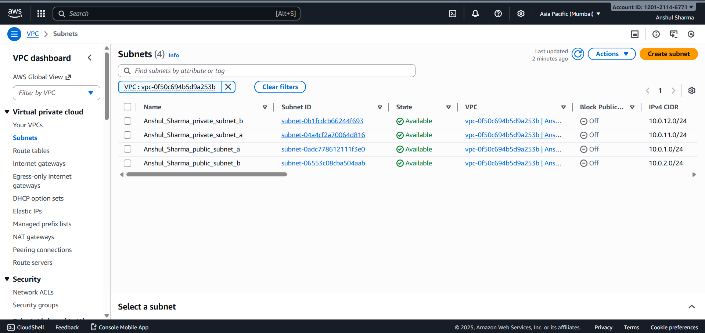
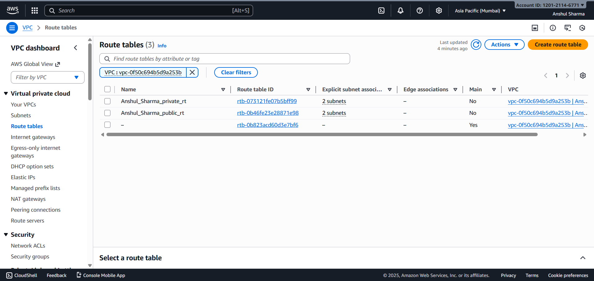

# Q1 – AWS VPC Networking Setup  
**Created by: Anshul Sharma**

---

## 📌 **Architecture Summary**
I designed a custom VPC with CIDR `10.0.0.0/16` and divided it into **2 public** and **2 private** subnets across two Availability Zones for high availability.  
An Internet Gateway enables public traffic, and a NAT Gateway in a public subnet allows **secure outbound internet access** for private subnets.  
Separate route tables were configured for correct routing.  
All resources were created using Terraform with the prefix **Anshul_Sharma_***.

---

## 🔐 **CIDR Ranges Used**
| Component | CIDR |
|----------|------|
| VPC | `10.0.0.0/16` |
| Public Subnet A | `10.0.1.0/24` |
| Public Subnet B | `10.0.2.0/24` |
| Private Subnet A | `10.0.11.0/24` |
| Private Subnet B | `10.0.12.0/24` |

Reason: These ranges provide clean separation and enough IPs for scaling.

---

## 📸 **Screenshots**

### ✔ VPC

### ✔ Subnets

### ✔ Route Tables

### ✔ NAT Gateway + IGW
  

---

## 🧩 **Terraform Code**
Link: *https://github.com/AnshulSharma2005/aws-assessment-anshul-sharma/q1-vpc-networking*

---

## **Output**
VPC ID:
vpc-0f50c694b5d9a253b

Public Subnets:
- subnet-0adc778612111f3e0
- subnet-06553c08cba504aab

Private Subnets:
- subnet-04a4cf2a70064d816
- subnet-0b1fcdcb66244f693