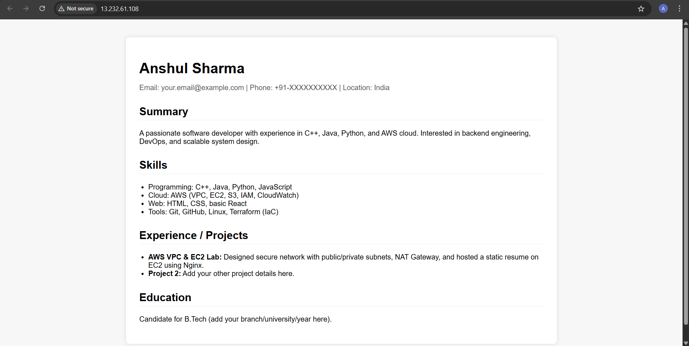

# Q2 – EC2 Static Resume Website  
**Created by: Anshul Sharma**

---

## 📌 Approach Summary
A free-tier EC2 instance (t2.micro) was launched in a **public subnet**.  
Nginx was installed using a `user_data.sh` script, and my resume HTML file was hosted inside `/usr/share/nginx/html/`.  
Security Group allowed HTTP (80) and limited SSH.  
The website is accessible through EC2 public IP and DNS.

---

## 📸 Screenshots

### ✔ EC2 Instance

### ✔ Security Group

### ✔ Website Output

---

## 🧩 Terraform + User Data Script  
GitHub:  
*https://github.com/AnshulSharma2005/aws-assessment-anshul-sharma/q2-ec2-static-website*

---

## 🌐 Public Website
http://13.232.61.108/