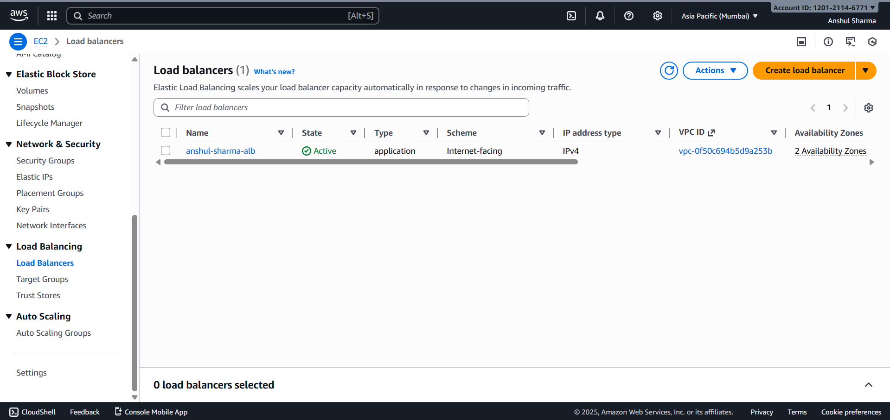
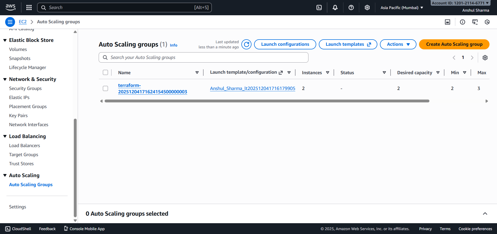
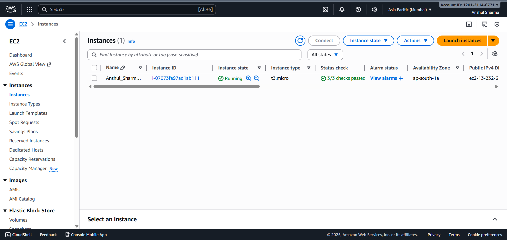

# Q3 – High Availability Architecture (ALB + ASG)  
**Created by: Anshul Sharma**

---

## 📌 Architecture Explanation
The EC2 instance hosting the resume site was migrated into **private subnets**, improving security.  
An **Application Load Balancer (ALB)** was deployed in the public subnets to handle traffic.  
An Auto Scaling Group (ASG) with a Launch Template ensures high availability across AZs.  
Traffic flow:  
**Client → ALB → Target Group → EC2 instances in private subnets**

---

## 📸 Screenshots

### ✔ Application Load Balancer

### ✔ Target Group

### ✔ Auto Scaling Group

### ✔ EC2 Instances launched by ASG

---

## 🧩 Terraform Code
GitHub:  
*https://github.com/AnshulSharma2005/aws-assessment-anshul-sharma/q3-ha-autoscaling*

---

## 🌐 ALB DNS Output
http://anshul-sharma-alb-1783989660.ap-south-1.elb.amazonaws.com/