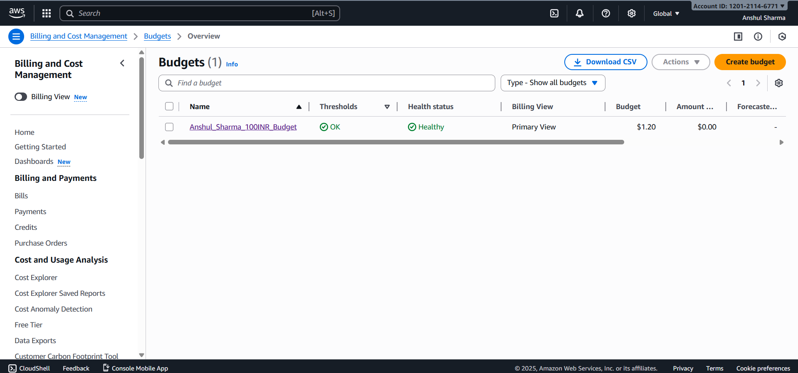
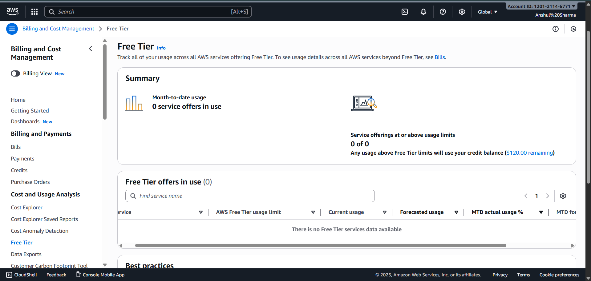

# Q4 – AWS Billing & Free Tier Monitoring  
**Created by: Anshul Sharma**

---

## 📌 Why Cost Monitoring?
Beginners often leave resources running, causing unexpected charges.  
Billing alarms prevent surprises by notifying when spending exceeds a threshold.  
Free Tier usage alerts help identify when you are close to crossing 12-month limits.  
Sudden AWS bill increases happen due to:  
- EC2 running 24×7  
- NAT Gateways  
- Load Balancers  
- Large S3 usage  
- Backup or snapshot accumulation

---

## 📸 Screenshots

### ✔ Billing Alarm (₹100 Alert)

### ✔ Free Tier Alerts

---

## 📝 Steps performed
1. Enabled billing alerts from Billing Preferences  
2. Created CloudWatch Billing Alarm  
3. Set threshold = ₹100  
4. Enabled free-tier usage alerts  
